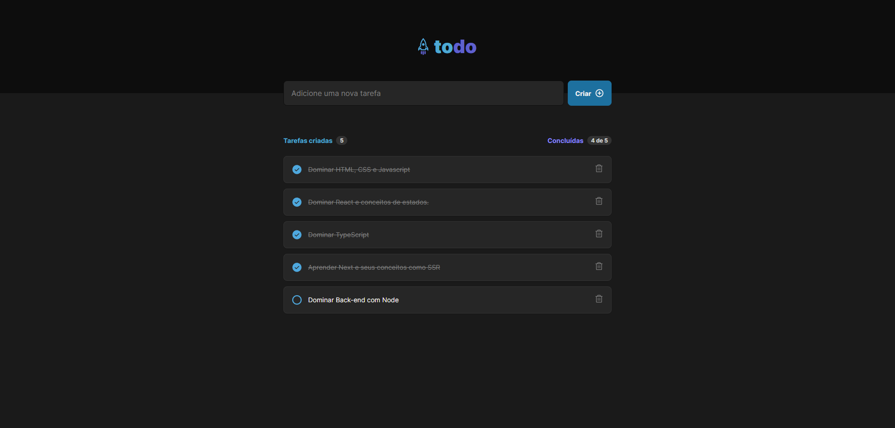

  

# 📝 To Do List

Todo App foi criado para resolução do desafio do curso Ignite (trilha atualizada) da Rocketseat. Essa aplicação apesar de simples é um excelente exemplo para praticar o desenvolvimento de apps CRUD (Create, Read, Update, Delete).

- Veja o projeto: [Live Preview](https://todo-list-ignite-victtor.vercel.app/)

## ⚙️ Funcionalidades

A aplicação é um controle de tarefas no estilo **to-do list**, que contém as seguintes funcionalidades:

- [x] Adicionar uma nova tarefa;
- [x] Marcar e desmarcar uma tarefa como concluída;
- [x] Remover uma tarefa da listagem;
- [x] Mostrar o progresso de conclusão das tarefas;
- [x] Salva as tarefas no LocalStorage;
- [x] Site com design simples e totalmente responsivo;

## 🚀 Tecnologias

- [x] [NodeJS](https://nodejs.org/en/)
- [x] [React](https://reactjs.org/)
- [x] [Vite](https://vitejs.dev/)
- [x] [TypeScript](https://www.typescriptlang.org/)
- [x] [UUID (V4)](https://www.npmjs.com/package/uuidv4)
- [x] [Phosphor Icons](https://phosphoricons.com/)

## 📝 Considerações

Apesar de novamente ser um projeto simples reforça e solidifica os conceitos importantes, fortalencendo a base que é super importante em qualquer aprendizado;
